<h1>Table of Contents<span class="tocSkip"></span></h1>
<div class="toc"><ul class="toc-item"><li><span><a href="#Preface" data-toc-modified-id="Preface-1">Preface</a></span></li><li><span><a href="#Introduction" data-toc-modified-id="Introduction-2">Introduction</a></span></li><li><span><a href="#Sampling" data-toc-modified-id="Sampling-3">Sampling</a></span></li><li><span><a href="#Convolution" data-toc-modified-id="Convolution-4">Convolution</a></span></li><li><span><a href="#Periodic-signals" data-toc-modified-id="Periodic-signals-5">Periodic signals</a></span></li><li><span><a href="#Fourier-series" data-toc-modified-id="Fourier-series-6">Fourier series</a></span></li><li><span><a href="#Fourier-transform" data-toc-modified-id="Fourier-transform-7">Fourier transform</a></span><ul class="toc-item"><li><span><a href="#Continuous-Fourier-transform" data-toc-modified-id="Continuous-Fourier-transform-7.1">Continuous Fourier transform</a></span></li><li><span><a href="#Discrete-Time-Fourier-transform-(DTFT)" data-toc-modified-id="Discrete-Time-Fourier-transform-(DTFT)-7.2">Discrete-Time Fourier transform (DTFT)</a></span></li><li><span><a href="#Discrete-Fourier-transform-(DFT)" data-toc-modified-id="Discrete-Fourier-transform-(DFT)-7.3">Discrete Fourier transform (DFT)</a></span></li></ul></li><li><span><a href="#Convolution-theorem" data-toc-modified-id="Convolution-theorem-8">Convolution theorem</a></span></li><li><span><a href="#Nyquist-Shannon-sampling-theorem" data-toc-modified-id="Nyquist-Shannon-sampling-theorem-9">Nyquist-Shannon sampling theorem</a></span></li><li><span><a href="#Short-time-Fourier-transform" data-toc-modified-id="Short-time-Fourier-transform-10">Short-time Fourier transform</a></span></li><li><span><a href="#Filters" data-toc-modified-id="Filters-11">Filters</a></span><ul class="toc-item"><li><span><a href="#Impulse-response" data-toc-modified-id="Impulse-response-11.1">Impulse response</a></span></li><li><span><a href="#Difference-equation" data-toc-modified-id="Difference-equation-11.2">Difference equation</a></span></li><li><span><a href="#Finite-impulse-response-(FIR)-filter" data-toc-modified-id="Finite-impulse-response-(FIR)-filter-11.3">Finite impulse response (FIR) filter</a></span></li><li><span><a href="#Infinite-impulse-response-(IIR)-filter" data-toc-modified-id="Infinite-impulse-response-(IIR)-filter-11.4">Infinite impulse response (IIR) filter</a></span></li><li><span><a href="#Filter-frequency-response" data-toc-modified-id="Filter-frequency-response-11.5">Filter frequency response</a></span></li></ul></li><li><span><a href="#Postface" data-toc-modified-id="Postface-12">Postface</a></span></li><li><span><a href="#References" data-toc-modified-id="References-13">References</a></span></li></ul></div>

# Preface

This notebook introduces fundamental digital signal processing (DSP) concepts used in the 02471 Machine Learning for Signal Processing course at the Technical University of Denmark. It is targeted to students who are not familiar with signal processing and need a resource to catch up. Note that this is however by no means a substitute for the course prerequisites; signal processing is difficult and this notebook is far from being exhaustive. Students are invited to check other well established resources when in doubt, or come forward with questions.

If you are reading this from the README.md, I recommend switching the [IPython notebook](https://nbviewer.jupyter.org/github/philgzl/dsp-primer/blob/master/notebook.ipynb) instead, where the math formulas are better rendered. You can also download the notebook to modify and run the code snippets. If you prefer MATLAB you can also check the [transcript.m](https://github.com/philgzl/dsp-primer/blob/master/transcript.m) file where all the code snippets were translated to MATLAB.

The following assumes you are familiar with real analysis mathematics.

# Introduction

In signal processing, a signal usually refers to a time varying function or variable. Signals can be discrete (e.g. characters in a sentence) or continuous (e.g. pressure, voltage) by nature. In the real world, signals are usually captured by sensors (e.g. a microphone captures pressure variations and converts them to an electrical signal).

A digital signal is a discrete representation of a signal. If the signal is continuous by nature, the digital signal has been derived by sampling and quantization. Digital signal processing (DSP) is the analysis and processing of digital signals.

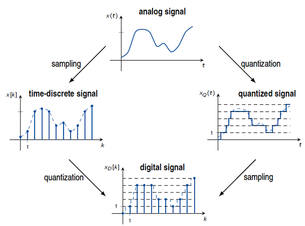

Sampling and quantization is performed by a analog-to-digital converter (ADC). The digital signal can then be processed by DSP processors. If needed, it can be converted back to a continuous signal by a digital-to-analog converter (DAC). ADCs and DACs are embedded in a wide range of consumer products.

E.g. the electrical signal produced by the microphone on a laptop is fed to a built-in ADC, and this signal can then be compressed by a DSP processor to be sent over the Internet. Conversely, a DAC converts the digital sound signals to continuous electrical signals so they can be emitted by the laptop speakers.

A typical signal processing chain is depicted below.

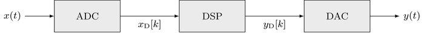

# Sampling

In math terms, the sampling of a continuous signal can be described as follows. Let  a continuous signal,


A digital representation of  noted  can be defined as follows,


where  is the **sampling period**. The smaller , the finer and more accurate the digital representation of the signal, but also the more space it takes in memory. The sampling operation is more commonly characterized by the **sampling frequency** (or sampling rate) ,


**Example**: common audio sampling frequencies are 8 kHz (telecommunications), 44.1 kHz (music CDs) and 48 kHz (movie tracks).

**Note**: In signal processing, notations like  are widely used to refer to a continuous signal or function, without introducing . In other words,  does not refer to the value taken by  at , but refers to the function  of the dependent variable . Similarly,  refers to the function  of the variable discrete variable . The usage of brackets is widely used to distinguish discrete signals from analog signals.

**Note**: the signals above were introduced as taking values in  but they can also take values in .

The sampling of a continuous signal can be seen as the product of the original signal with a **Dirac comb**. The Dirac comb with period  is defined as


where  is the Dirac delta function. In other words,  is the function that equals zero everywhere except on points evenly spaced by .

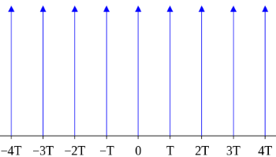

Sampling  can be seen as multiplying  with ,


This will be useful in the following.

# Convolution

The convolution is a mathematical operation between two functions and outputs a new function. It is a fundamental tool in signal processing. The convolution operator is noted  and it is well defined for integrable functions in ,


It is defined as


The convolution is commutative: .

The **discrete convolution** is the adaptation to discrete signals and is defined as


For discrete signals with finite lengths, signal values outside the definition range are assumed to be 0, and the sum becomes finite as most of the terms equal zero. E.g. if  with length  is defined for , and  with length  is defined for , then  has length  and is defined for  .

The best way to the understand this operation is to look at a visual representation. The convolution can be seen as an inversion of one of the signals, followed by a "delay-and-product-sum" operation; for each delay value  or , one signal is delayed with respect to the other before integrating the product of the signals. In the animation below, the convolution result  in black is obtained by integrating the green area at each time step.

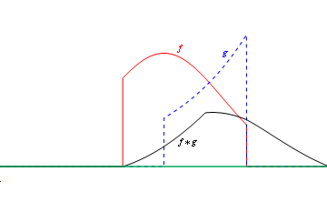

**Example**: The identity element for the convolution is the Dirac delta impulse,


You can prove it as an exercise.

**Example**: The L-point moving average of a time series can be expressed as a convolution. Consider  a time series and  its L-point moving average,


where .

Below I use `numpy.convolve` to convolve an arbitrary signal with .


```python
import matplotlib.pyplot as plt
import numpy as np

plt.rcParams['axes.grid'] = True

n = 11  # number of points
x = np.linspace(0, 1, n)**2 ; x = np.minimum(x, x[::-1])  # arbitrary signal
L = 5  # number of points to average
h = np.ones(L)/L
y = np.convolve(h, x)

fig, ax = plt.subplots(figsize=(10, 3))
ax.plot(x, 'o-', label='$x$')
ax.plot(h, 'o-', label='$h$')
ax.plot(y, 'o-', label='$y=h*x$')
ax.legend()
plt.show()
```


    
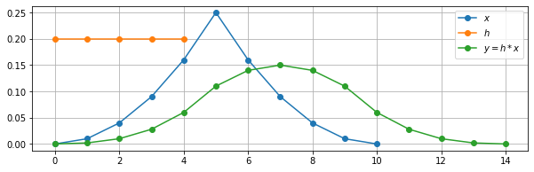
    


# Periodic signals

Let  a periodic signal. Therefore, there exists a period  such that


A periodic signal can also be characterized by its frequency ,


Examples of periodic signals:
* Sinusoids: 
* Complex exponentials: 
* Temperature across years (disregarding rising trend due to global warming)

# Fourier series

Any continuous periodic signal can be written as a discrete sum of complex exponentials called Fourier series.

Let  be a periodic signal with period . Therefore, there exists a sequence  in  such that


The  are called the **Fourier coefficients**.

If  is real-valued, then for all ,  and  are complex conjugates and the sum can be rearranged as a sum of sines and cosines,


This property is very powerful as it means that we can think of any periodic signal as a sum of well-known functions, the complex exponentials, which form a basis of functions in the  sense. This means that the  can be derived by projecting  onto the individual basis functions,


The Fourier series are a primary motivation of the **Fourier transform** (see further below).

**Example**: Let  a sine function with frequency ,


Euler's formula allows to rewrite  as


Here the Fourier coefficients can be directly identified. We have
* ,
* ,
*  if .

**Example**: Let  a sawtooth wave with period ,


It can be shown that  can be rewritten as an infinite sum of sines,


The Fourier coefficients here are

*  if 0">,

*  if ,

*  if .

Or using  and  coefficients,

*  for all 0">,

*  for all .

In the snippet below I verify this by adding a finite amount of these sines. We can see the more sines are added, the more the total sum resembles a sawtooth wave.


```python
n = 500  # number of points
n_T = 3  # number of periods

t = np.arange(n)/n*n_T*2*np.pi
x = (t/np.pi + 1) % 2 - 1

fig, ax = plt.subplots(figsize=(12, 4))
ax.plot(t, x, label='sawtooth')

for n_components in [1, 2, 5, 10]:
    x = 0
    for k in range(1, n_components+1):
        x += -2/np.pi*(-1)**k/k*np.sin(k*t)
    ax.plot(t, x, label=f'{k} components')

ax.legend()
plt.show()  # you should see the more sines we add, the closer the total sum resembles a sawtooth wave
```


    
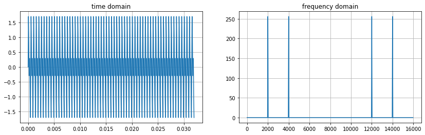
    


# Fourier transform

## Continuous Fourier transform

The Fourier transform is a mathematical operation that decomposes functions depending on time into functions depending on frequency. The term *Fourier transform* can refer to both the frequency domain representation of a signal and the mathematical operation itself.

The Fourier transform is first formally defined for continuous signals (not necessarily periodic) and outputs a new continuous function depending on frequency. It is commonly noted  and is defined as


In other words, given  a continuous function depending on time,


This can be seen as the projection of  onto the basis of complex exponentials.

A few notes/properties:
* The Fourier transform of  is a function of  which is a frequency variable in radian per second (rad/s). Sometimes, a frequency variable in Hertz and noted  is used instead, in which case  and the integral is changed accordingly.
* The Fourier transform takes **complex** values
* The Fourier transform is **linear**: 
* It is common to note the Fourier transform of  with an uppercase like this: .
    * Sometimes it is noted like this to emphasize on the dependent variables: 
* The inverse Fourier transform of  is  which is the same as the forward Fourier transform except there is a normalization factor and a plus sign in the exponential.

## Discrete-Time Fourier transform (DTFT)

Let  a discrete signal with infinite length (not necessarily periodic). The discrete-time Fourier transform (DTFT) of  is defined as


Again, this resembles a projection on the basis of complex exponentials, except it is adapted for a discrete signal by replacing the integration sign with a discrete sum over the signal values.

The DTFT is  periodic. The inverse DTFT is


This is a first adaptation for discrete signals, except the summation is infinite and it still takes values in an infinite and continuous frequency space. The next step is to *truncate* and *sample* the DTFT at evenly spaced frequency points, to obtain discrete Fourier transform (DFT).

## Discrete Fourier transform (DFT)

Let  a discrete signal of finite length . That is, we have a sequence of  values . The DFT of  is defined as


The inverse DFT is


The DFT takes as input a discrete and finite amount of values and outputs a discrete and finite amount of values, so it can be explicitely calculated using computers, unlike the DTFT.

Below is an overview of the different transforms. For a more complete explanation of the steps between Fourier transform, DTFT and DFT, you can refer to [Proakis and Manolakis](#References), Chapters 4 and 7.

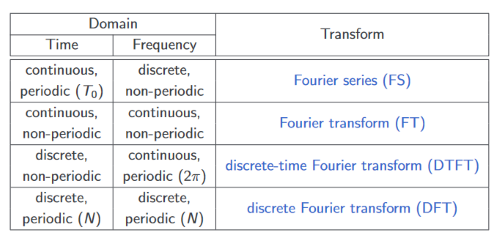


The DFT plays a huge role in DSP, and while the math theory behind can be difficult to fully grasp, it is absolutely essential to understand the gist of it: **it decomposes signals into frequencies**. The frequency components are best observed by plotting the (squared) modulus of the Fourier transform. The modulus of the Fourier transform is often referred to as **magnitude spectrum**, and the analysis of signals using the Fourier transform as **spectral analysis**. The phase information is more difficult to interpret and can be disregarded for this course.

The DFT is implemented in `numpy` under `numpy.fft.fft`. FFT stands for fast Fourier transform and is an efficient algorithm to calculate the DFT. The terms FFT and DFT are often used interchangeably.

**Example**: Let's create a signal consisting of a sum of 2 sinusoids with different frequencies and calculate its DFT. You can seel see how the DFT is able to resolve the 2 components.


```python
n = 512  # number of points
fs = 16e3  # sampling frequency

f1 = 2000  # frequency of the first component
f2 = 4000  # frequency of the second component

t = np.arange(n)/fs  # time axis
x = np.sin(2*np.pi*f1*t) + np.sin(2*np.pi*f2*t)  # time-domain signal
X = np.fft.fft(x)  # DFT
f = np.arange(n)/n*fs  # frequency axis; see details further below

fig, axes = plt.subplots(1, 2, figsize=(14, 4))
axes[0].plot(t, x)
axes[0].set_title('Time domain')
axes[0].set_xlabel('Time (s)')
axes[1].plot(f, np.abs(X))  # we plot the magnitude as X is complex
axes[1].set_title('Frequency domain')
axes[1].set_xlabel('Frequency (Hz)')

plt.show()  # you should see two clean spikes at locations corresponding to f1 and f2
# you should also see two extra spikes at fs-f1 and fs-f2; see details further below
```


    
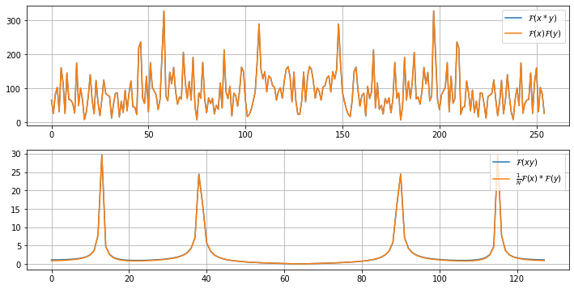
    


A few practical notes:
* The DFT output is **two-sided**. Half of it's values correspond to **negative** frequencies. This makes sense for complex-valued signals, but for real-valued signals, opposite frequencies are conjugates and the information is thus redundant. It is thus common to **crop half of the FFT output**. You can also check the documentation for `numpy.fft.rfft` for more details, which outputs a one-sided signal already.
* Building the frequency vector axis for the output can be confusing. However you should keep in mind that **the resolution in the frequency domain is always **, where  is the sampling frequency and  is the number of points.
    * This means that increasing  gives a worse resolution in the frequency domain. **A finer resolution in the time domain means a coarser resolution in the frequency domain**. This is known as the **time-frequency duality**.
    * The frequency values corresponding to the raw FFT output are ordered as follows:
        * if N is even:

        

        * if N is odd:

        

      We first have the positive frequencies in increasing order up to , and then the negative frequencies increasing from  to 0. These frequency values are commonly called **frequency bins**, as if the energy is falling in *bins* centered at those frequencies. 

FAQ:
* *But you drew positive frequencies in the frequency-domain plot above up to !*
    * Yes, these are the negative frequencies, and I didn't remove them to show how the raw FFT output looks like. Normally one would crop them out or use `numpy.fft.rfft` directly. If you want to plot the entire spectrum including negative frequencies, then you would usually replace the positive frequencies above  with the corresponding negative frequencies and flip the two halves such that the values increase from - to . This can also be done using `numpy.fft.fftshift`.
* *What about the frequencies above  contained in the signal then?*
    * If the sampling frequency is , then the maximum representable frequency in the digital signal is . In other words, if a continuous signal is sampled at a sampling frequency , then all the information at frequencies above  is lost. This is the **Nyquist-Shannon sampling theorem** and is discussed further below.
* *Considering if  is even or odd is tedious... How can I easily and consistently build the frequency vector axis correctly?*
    * You can use `numpy.fft.fftfreq` or `numpy.fft.rfftfreq`. You can also do it manually as follows:
        * I remember the resolution is always  and build the entire frequency vector of length  including the frequencies above  (or negative frequencies): `f = np.arange(n)/n*fs`
        * I find the frequencies strictly above : `mask = f > fs/2`
            * If I want a one-sided spectrum I discard them: `f = f[~mask]`
            * If I want a two-sided spectrum I subtract  to them: `f[mask] -= fs`
      
      This will consistently give a correct frequency axis regardless of  being even or odd.

**More examples**: Below I plot a series of common Fourier transforms.


```python
n_rows = 8
fig, axes = plt.subplots(n_rows, 2, figsize=(12.5, 9))
axes[0, 0].set_title('Time domain')
axes[0, 1].set_title('Frequency domain')
for row in range(n_rows-1):
    axes[row, 0].set_xticklabels([])
    axes[row, 1].set_xticklabels([])

n = 512
t = np.arange(n) - n//2
f = np.fft.fftfreq(n); f = np.fft.fftshift(f)

def plot_row(row, x, ylabel):
    X = np.fft.fft(x); X = np.fft.fftshift(X)
    axes[row, 0].plot(t, x)
    axes[row, 1].plot(f, abs(X))
    axes[row, 0].set_ylabel(ylabel)

# dirac
x = np.zeros(n); x[n//2] = 1
plot_row(0, x, 'dirac')

# constant
x = np.ones(n)
plot_row(1, x, 'constant')

# rectangle
x = abs(t) < n*0.025
plot_row(2, x, 'rectangle')

# sinc
x = np.sinc(t*0.1)
plot_row(3, x, 'sinc')

# comb
x = np.zeros(n); x[t%(n//32)==0] = 1
plot_row(4, x, 'comb')

# sine
x = np.sin(2*np.pi*t*0.05)
plot_row(5, x, 'sine')

# cosine
x = np.cos(2*np.pi*t*0.05)
plot_row(6, x, 'cosine')

# sawtooth
x = (t*0.1 + 1) % 2 - 1
plot_row(7, x, 'sawtooth')

fig.tight_layout()
plt.show()
```


    
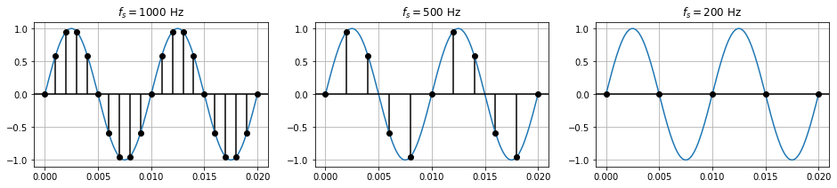
    


A few important Fourier transforms (FT) to note here:
* The FT of a Dirac impulse is an infinitely-long rectangular window. Conversely, the FT of an infinitely-long rectangular window is a Dirac impulse.
    * This again is related to the **time-frequency duality**. A signal that is very narrow in time is very broad in frequency. Conversely, a signal that is very localized in frequency is very broad in time.
* The FT of a rectangular window is a sinc function (the time-domain plot is the absolute value). Conversely, the FT of a sinc function is a rectangular window.
    * In accordance with the time-frequency duality, the narrower the rectangular window in one domain, the wider the sinc function in the other domain.
* The FT of a Dirac comb is also a Dirac comb!
    * This will be useful when explaining the Nyquist-Shannon sampling theorem further below.
* The FT of the sawtooth signal shows decaying spikes equally spaced at multiples of the fundamental frequency, in accordance with the Fourier series expression introduced further above!

# Convolution theorem

The convolution theorem states that convolution in the time-domain is the same as multiplication in the frequency domain. Conversely, multiplication in the time-domain is the same as convolution in the frequency domain.

In the continuous case, let  and  two signals in . With  the Fourier transform operator for continuous functions, and  the continuous convolution operator, we have


This is very powerful as it means we can decide to derive a convolution, which is usually an expensive operation, in the frequency domain instead. Indeed, an immediate consequence is


This means we can perform a multiplication in the frequency domain and use back and forth Fourier transforms between the time and frequency domains to obtain the same result as a convolution in the time domain.

Now for discrete signals, let  and  two signals of length . With  the DFT operator and  the discrete convolution operator, we have


Note that if  and  do not have same length, we can simply zero-pad the shorter signal until lengths are the same, such that point-wise multiplication is possible.

In the snippet below I attempt to verify both properties.


```python
n = 128  # number of points

fig, axes = plt.subplots(2, 1, figsize=(12, 6))

# first property: F(x*y)=F(x)F(y)
x = np.random.randn(n)
y = np.random.randn(n)
z = np.convolve(x, y)

X = np.fft.fft(x, n=len(z))  # forcing the FFT output to be same length as z
Y = np.fft.fft(y, n=len(z))  # forcing the FFT output to be same length as z

Z1 = np.fft.fft(z)
Z2 = X*Y

axes[0].plot(abs(Z1), label=r'$\mathcal{F}(x*y)$')
axes[0].plot(abs(Z2), label=r'$\mathcal{F}(x)\mathcal{F}(y)$')
axes[0].legend(loc='upper right')

# second property: F(xy)=F(x)*F(y)
# this one is a bit trickier as we need to flip the FFTs before convolving
# we also need to filter out all the extra frequencies resulting from the convolution in the frequency domain
x = np.sin(2*np.pi*np.arange(n)*0.3)  # using random noise here does not give perfect result
y = np.sin(2*np.pi*np.arange(n)*0.1)  # using random noise here does not give perfect result
z = x*y

X = np.fft.fft(x)
Y = np.fft.fft(y)
X = np.fft.fftshift(X)  # flip before convolving
Y = np.fft.fftshift(Y)  # flip before convolving

Z1 = np.fft.fft(z)
Z1 = np.fft.fftshift(Z1)
Z2 = np.convolve(X, Y)/n
Z2 = Z2[n//2:-n//2+1]  # discard extra frequencies created from the convolution

axes[1].plot(abs(Z1), label=r'$\mathcal{F}(xy)$')
axes[1].plot(abs(Z2), label=r'$\frac{1}{N}\mathcal{F}(x)*\mathcal{F}(y)$')
axes[1].legend(loc='upper right')

plt.show()  # you should observe the curves overlap in both plots
```


    
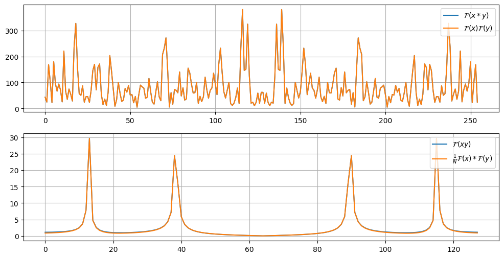
    


# Nyquist-Shannon sampling theorem

Briefly put, when sampling at a frequency , the sampling theorem says that the highest representable frequency is . In other words, the sampling frequency should be at least twice as high as the highest frequency component of the sampled signal.

A simple example to illustrate this is the sampling of a sinusoid. Consider a sinusoid with frequency  sampled at a different frequencies .


```python
f0 = 100  # sinusoid frequency
T = 2e-2  # sinusoid duration in seconds

# first create a sinusoid with a fine time step; this will represent the continuous signal
fs_hi = 8e3  # high sampling frequency
t_cont = np.arange(0, T+1/fs_hi, 1/fs_hi)  # fine time vector with time step 1/fs
x_cont = np.sin(2*np.pi*f0*t_cont)  # this represents the continuous signal

fig, axes = plt.subplots(1, 3, figsize=(16, 3))

# now let's create a coarse digital signals for different low sampling frequencies
for ax, fs_lo in zip(axes, [1000, 500, 200]):
    ax.plot(t_cont, x_cont)
    t_coarse = np.arange(0, T+1/fs_lo, 1/fs_lo)
    x_coarse = np.sin(2*np.pi*f0*t_coarse)
    ax.stem(t_coarse, x_coarse, 'k', markerfmt='ko', basefmt=' ')
    ax.axhline(0, color='k')
    ax.set_title(f'$f_s={fs_lo}$ Hz')

plt.show()
```


    
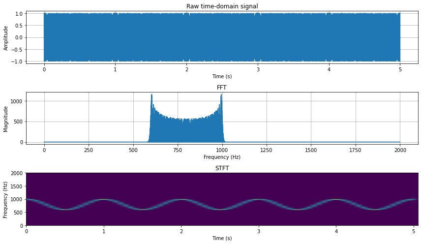
    


Can you see where the problem arises once we set  below ? It will not be possible to reconstruct the continuous signal anymore from the digital signal. To understand why, imagine  and two sinusoids, one at  and .


```python
fig, ax = plt.subplots(figsize=(6, 3))

f0 = 100
f1 = 80

x_cont = np.cos(2*np.pi*f0*t_cont)
ax.plot(t_cont, x_cont, label=f'$f_0={f0}$ Hz')

x_cont = np.cos(2*np.pi*f1*t_cont)
ax.plot(t_cont, x_cont, label=f'$f_1={f1}$ Hz')

fs_lo = 180
t_coarse = np.arange(0, T, 1/fs_lo)
x_coarse = np.cos(2*np.pi*f0*t_coarse)
ax.stem(t_coarse, x_coarse, 'k', markerfmt='ko', basefmt=' ')
ax.axhline(0, color='k')

ax.set_title(f'$f_s={fs_lo}$ Hz')
ax.legend()

plt.show()
```


    
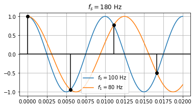
    


As you can see, both signals produce the exact same samples! It's therefore impossible to know from the samples if the signal is a sinusoid at 80 Hz or a sinusoid at 100 Hz.

This can be explained for any signal using the convolution theorem and the Dirac comb function. Remember we saw sampling is the same as multiplying the signal with the Dirac comb,


where  is the sampling period. The convolution theorem states the Fourier transform of a product is the convolution of the Fourier transforms in the frequency domain:


Now it can be shown that the Fourier transform of a Dirac comb is also a Dirac comb (you can try to prove it as an exercise) with period ,


Therefore, sampling in the time-domain is the same as convolving with a Dirac comb in the frequency domain. And convolving with a Dirac comb is the same as replicating the signal infinitely, with replicas evenly spaced by .

The image below describes this.  is an example spectrum of the original continuous signal , while  is the spectrum of the sampled signal . Since  is real-valued,  is symmetric around . The spectrum is replicated infinitely along the frequency axis, with copies evenly spaced by . The highest frequency component of the original signal is .

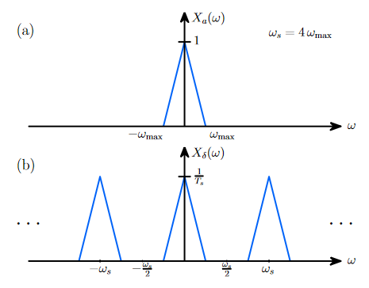

We can see now that if we have \frac{\omega_s}{2}">, the replicas would **overlap**. The frequency components above  would mirror back and get confused with lower frequencies. This is called **aliasing**. The highest representable frequency, i.e.  in rad/s or  in Hz, is called the **Nyquist frequency**. The signal frequency content should be below the Nyquist frequency, otherwise we are undersampling the signal and aliasing occurs.

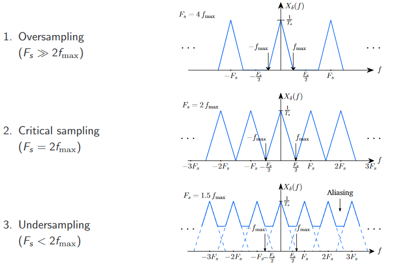

# Short-time Fourier transform

Imagine we wish to perform the spectral analysis of a short audio recording of 1 second. At 44.1 kHz, which is a common audio sampling rate, this audio recording would consist of 44100 samples. One way to proceed would be to perform the 44100-point FFT of the entire signal in one go, and end with a 44100 frequency bins-long spectrum.

This is a bit silly, as on top of a 44100-point FFT being expensive (the FFT complexity is  at best and  at worst), we rarely need such a fine description of the signal spectrum in the frequency domain. And this is a 1 second-long signal only!

What is more common to do is to segment the signal in the time domain and perform the FFT of each segment. This is called a Short-time Fourier transform (STFT). This means we can have a representation of the signal that is both a function of time (frame number) and frequency!

The STFT of  noted  can be formally defined as


where


and
*  is the frequency bin index 
*  is the frame index
*  is the frame length—it's the number of signal samples in each segment
*  is the hop length—it's the number of signal samples between adjacent segments
    * Sometimes the overlap length  is specified instead: 
*  is the analysis window function of length —it's commonly used to reduce spectral leakage
    * I am not covering spectral leakage in this notebook but you can refer to [Oppenheim, Schafer and Buck](#References), Chapter 10
*  is the number of points after zero-padding the windows—it's also the number of FFT points

The STFT is implemented in `scipy` under `scipy.signal.stft`,
* the `nperseg` argument corresponds to 
* the `noverlap` argument corresponds to 
* the `nfft` argument corresponds to 
* the `window` argument corresponds to 

The function also takes as arguments the sampling frequency `fs` to return the corresponding time and frequency vectors.

In the example below I generate a sinusoid whose frequency is modulated by another sinusoid. The FFT of the entire signal shows high values across the entire range of swept frequencies, while the STFT allows to observe how the frequency changes over time.


```python
from scipy.signal import stft

fs = 4e3  # sampling frequency
f_mod = 1  # modulation frequency
f_delta = 200  # modulation depth
f0 = 800  # carrier frequency
T = 5  # signal duration
t = np.arange(0, T, 1/fs)  # time vector
x = np.sin(2*np.pi*t*f0 + f_delta/f_mod*np.sin(2*np.pi*t*f_mod))

fig, axes = plt.subplots(3, 1, figsize=(12, 7))

axes[0].plot(t, x)
axes[0].set_title('Raw time-domain signal')
axes[0].set_xlabel('Time (s)')
axes[0].set_ylabel('Amplitude')

X = np.fft.rfft(x)
f = np.fft.rfftfreq(len(x), 1/fs)

axes[1].plot(f, abs(X))
axes[1].set_title('FFT')
axes[1].set_xlabel('Frequency (Hz)')
axes[1].set_ylabel('Magnitude')

f, t, S = stft(x, fs, nperseg=512)

axes[2].pcolormesh(t, f, abs(S), shading='gouraud')
axes[2].set_title('STFT')
axes[2].set_xlabel('Time (s)')
axes[2].set_ylabel('Frequency (Hz)')

fig.tight_layout()
plt.show()
```

    /tmp/ipykernel_15125/2720074634.py:28: MatplotlibDeprecationWarning: Auto-removal of grids by pcolor() and pcolormesh() is deprecated since 3.5 and will be removed two minor releases later; please call grid(False) first.
      axes[2].pcolormesh(t, f, abs(S), shading='gouraud')


    
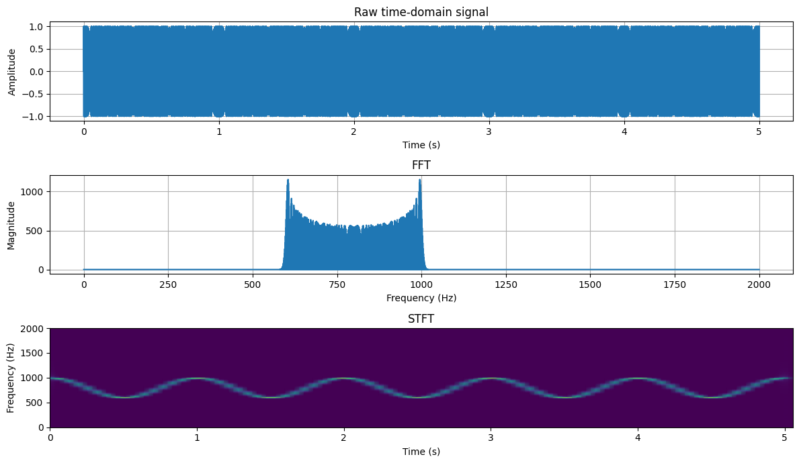
    


FAQ
* *What if I still want to have a representation of my signal that depends only on frequency? E.g. if I am interested in the average energy in each frequency bin?*
    * You can still use the STFT and average the energy across frames! This is the long-term average spectrum (LTAS) and is a cleaner way to visualize the signal energy in each frequency bin.


```python
from scipy.signal import stft

fig, axes = plt.subplots(2, 1, figsize=(12, 5))

X = np.fft.rfft(x)
f = np.fft.rfftfreq(len(x), 1/fs)

axes[0].plot(f, abs(X))
axes[0].set_title('FFT (ugly)')
axes[0].set_xlabel('Frequency (Hz)')
axes[0].set_ylabel('Magnitude')

f, t, S = stft(x, fs, nperseg=512)
LTAS = np.mean(abs(S), axis=1)

axes[1].plot(f, LTAS)
axes[1].set_title('LTAS (clean)')
axes[1].set_xlabel('Frequency (Hz)')
axes[1].set_ylabel('Magnitude')

fig.tight_layout()
plt.show()
```


    
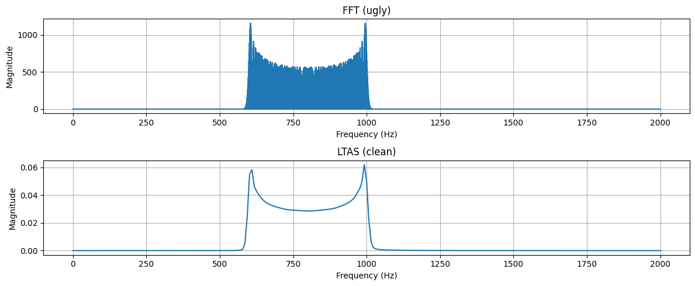
    


* *But the magnitude (y-axis) does not match!*
    * There are different ways of normalizing the FFT and the STFT. Here the STFT implementation of `scipy` applies a normalization whereas `np.fft.fft` does not. There is also windowing coming into play. Ultimately this does not matter so much for this course and the most important is the location of the peaks and their relative difference.
* *How do I chose the length of the frame/window (`nperseg` argument)?*
    * This is up to you. A shorter frame size will give you a better time resolution, but a worse frequency resolution. Conversely a longer frame gives a worse time resolution, but a better frequency resolution. This is again the **time-frequency duality**. However the FFT is the fastest for signal lengths equal to a power of 2. So common frame sizes for audio analysis are e.g. 256, 512, 1024, 2048 or 4096, depending on the sampling rate. For other applications with different sampling rates, frame sizes must be adapted accordingly.

# Filters

A filter is a system that performs mathematical operations on a signal in the time domain and outputs a new signal in the time domain.

Filters can be analog for continuous signals (electronic circuits consisting of capacitors and coils in e.g. guitar amps or speaker crossover filters), or digital for discrete signals (integrated circuits). In this course we will only cover digital filters.

In DSP, filters are linear time-invariant (LTI) systems. Consider two digital signals  and  (note that  refers to the function  of the discrete dependent variable , and not the value taken by  on a fixed ). A system  is an LTI system if it verifies the following properties:
* Linearity: 
    * Another way to write it is as follows: 
* Time-invariance: 
    * Another way to write it is as follows: 
    * In other words, this means LTI systems do not change over time; if the input is delayed, the output is also delayed by the same amount.

In the following,  denotes the input of the filter, while  denotes the output of the filter.

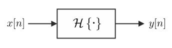

## Impulse response

A filter can be described by its **impulse response**. The impulse response is, as the name suggests, the output of the filter when presented a Dirac impulse ,


The reason why  fully describes the system follows. Since  is the identity element for the convolution, we have


This means that if we know , we can derive the output  from the filter given an arbitrary input  by calculating the convolution of  with .

## Difference equation

A digital filter can also be described by its difference equation,


or, if we want the output  isolated on the left side and assume ,


* The  are the **feedback coefficients** (similar to autoregressive coefficients in time series analysis)
* The  are the **feedforward coefficients** (similar to moving-average coefficients in time series analysis)
* The **filter order** is 

Note that we usually force . If it's not the case we can simply divide all the coefficients by  without changing the filter behavior.

**Examples:**

* L-point moving average filter:


  Here  and  for . The filter order is .

* Exponential smoothing with smoothing factor :


  Here ,  and . The filter order is 1.

## Finite impulse response (FIR) filter

If there are no feedback coefficients (except ), then the filter is an **FIR filter**,


FIR filters are very **stable**, but computationally more **expensive**.

The impulse response of an FIR filter  is


Therefore the impulse response of an FIR filter is simply the sequence of feedforward coefficients: .

**Example**: The L-point moving average filter is an FIR filter. Its impulse response is .

## Infinite impulse response (IIR) filter

If there is at least one feedback coefficient (other than ), then the filter is an **IIR filter**,


IIR filters can be **unstable**, but are computationally much **cheaper**.

The impulse response of an IIR cannot be explicitly written; it is infinite.

**Example**: The exponential smoothing filter is an IIR filter,


Attempting to write the impulse response would look like this,


As you can see this would never end. Also if 1">, the output would explode and the filter would be unstable.

**Example**:

Digital filtering is implemented under `scipy.signal.lfilter`. The function takes as arguments the sequence of feedforward coefficients, the sequence of feedback coefficients and the input signal. Note the first feedforward coefficient, i.e. , must be 1.

Below I filter a noisy signal with a moving average filter and an exponential smoothing filter using `scipy.signal.lfilter`.


```python
from scipy.signal import lfilter

# an arbitrary noisy input signal
n = 512  # signal length
x = 0.5*np.random.randn(n) + np.cos(2*np.pi*np.arange(n)*0.01) + np.cos(2*np.pi*np.arange(n)*0.005)

# moving average filter
L = 10  # number of points to average
b = np.ones(L)/L  # feedforward coefficients
a = [1]  # feedback coefficients
y1 = lfilter(b, a, x)

# exponential smoothing filter
alpha = 0.9
b = [1-alpha]  # feedforward coefficients
a = [1, -alpha]  # feedback coefficients
y2 = lfilter(b, a, x)

fig, ax = plt.subplots(figsize=(13, 4))
ax.plot(x, label='input signal', alpha=0.7)
ax.plot(y1, label='moving average')
ax.plot(y2, label='exponential smoothing')
ax.legend()
fig.tight_layout()
plt.show()
```


    
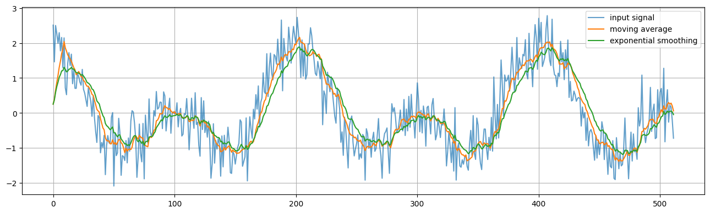
    


## Filter frequency response

We saw above that a filter can be characterized with the impulse response; filtering is the same as convolving with the impulse response of the filter. The convolution theorem tells us that a convolution in the time domain is the same as multiplication in the frequency domain. Therefore, we can perform a filtering operation in the frequency domain instead, by multiplying the Fourier transform of the input signal with the Fourier transform of the impulse response,


 is the frequency response of the filter. It's another description of the filter, this time in the frequency domain. It describes how each frequency component is modified in gain and phase.

Another way to look at it is as follows. Consider a fixed , and . That is,  is a digital signal consisting of a single pure tone (single complex exponential, single component) at frequency . The output of the filter is then


**Note**: Here  refers to the value taken by  on the fixed , and not the function  of the dependent variable .  is still referring to the function  though.

As we can see, the pure tone  is simply multiplied by . Since  is complex, this means  is transformed both in magnitude and in phase. In other words, the output is also a pure tone at the same frequency, only scaled and shifted. If we now instead consider an arbitrary input and think of it as an infinite sum of complex exponentials at different frequencies, and we remember filters are linear systems, then the output is simply the sum of all the components individually scaled and shifted according to the function . Which is why a description like  is so powerful. Beautiful, isn't it?

* *But what if the filter is an IIR filter? For an FIR filter,  can be obtained by calculating the DTFT of the impulse response, which is simply the sequence of feedforward coefficients. But for an IIR, the impulse response is infinite!*

We can still define the frequency response as follows. We saw above that if , then . Thus, starting from the difference equation,


Note that if there are no feedback coefficients except  (case of an FIR filter), then only the numerator remains, and we correctly obtain the DTFT of the sequence of feedforward coefficients (assuming  for  so the sum extends to infinity)!

**Example**:

A filter frequency response can be calculated using `scipy.signal.freqz`. The function takes as arguments the sequence of feedforward coefficients and the sequence of feedback coefficients. It can also take the number of evenly spaced frequency points `worN` at which to calculate the frequency response. The function outputs a frequency vector and the complex frequency response. Note the frequency vector ranges from 0 to , so you have to scale it so that it ranges from  to , depending on the sampling frequency  you are working with. You can also provide the `fs` argument to `scipy.signal.freqz` and the frequency vector output will be correctly scaled.

Let's calculate the frequency responses of the moving average and the exponential smoothing filters.


```python
from scipy.signal import freqz

# moving average filter
L = 10  # number of points to average
b = np.ones(L)/L  # feedforward coefficients
a = [1]  # feedback coefficients
w1, h1 = freqz(b, a)

# exponential smoothing filter
alpha = 0.9
b = [1-alpha]  # feedforward coefficients
a = [1, -alpha]  # feedback coefficients
w2, h2 = freqz(b, a)

fig, ax = plt.subplots(figsize=(12, 4))
ax.plot(w1, abs(h1), label='moving average')
ax.plot(w2, abs(h2), label='exponential smoothing')
ax.legend()
fig.tight_layout()
plt.show()
```


    
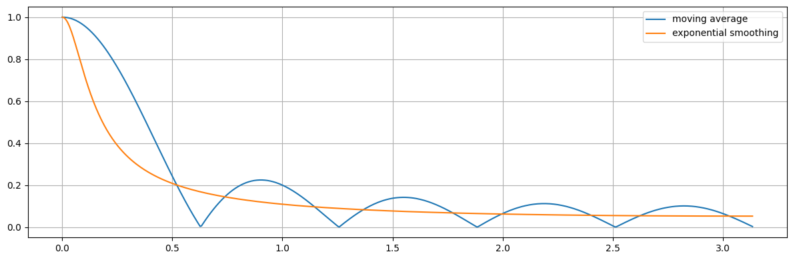
    


We can see both filters act as low-pass filters. They present a high gain close to 1 at low frequencies, and the gain decreases as the frequency increases. This means the filters attenuate high frequencies, while they let low frequencies go through. This makes sense, as the filters smooth out the fast and noisy fluctuations, which are high frequency.

FAQ:
* Can I use `np.fft.fft` instead of `scipy.signal.freqz` to plot the frequency response?
    * Technically yes, but I don't recommend it. `scipy.signal.freqz` uses `np.fft.fft` inside it. You can obtain the correct result with `np.fft.fft` if you discard the negative frequencies and you provide a sufficient number of FFT points `n`. But I recommend using `scipy.signal.freqz` instead, since it's specifically meant for filters; it takes coefficients `b` and `a` as arguments and outputs a one-sided, well-defined frequency response. Using `scipy.signal.freqz` for a filter shows you understand what you are doing.
* Can I use `scipy.signal.freqz` to plot a signal spectrum?
    * **NOOOOOOO**. `scipy.signal.freqz` plots a **frequency response**. A signal presents a **spectrum**, not a frequency response. A filter is a system, it takes signals as input/output and thus presents a **frequency response**, not a spectrum. Filter = frequency response, signal = spectrum. If you use `scipy.signal.freqz` to plot the frequency content of a signal, you are clearly showing you are not understanding what you are doing. What would happen if you use `scipy.signal.freqz` for a signal is that, since signal lengths are generally much larger than the number of frequency bins `worN` we wish to analyze (`worN` is 512 by default), the signal would be cropped and only the first `worN` samples would be analyzed! So for signal spectrums, please use `scipy.signal.stft` and average the energy across time-frames (see LTAS earlier), or use `np.fft.fft` on the whole signal (not recommended).

# Postface

Other important DSP subjects not covered in this notebook include:
* window functions
* spectral leakage
* filter design
* biquad filters
* Z-transform
* power spectral density

If you find typos, I would greatly appreciate it if you reported them ❤️.

# References

* Alan V. Oppenheim, Ronald W. Schafer and John R. Buck. *Discrete-time signal processing* (2nd ed.). Prentice Hall, 1999.
* John G. Proakis and Dimitris G. Manolakis. *Introduction to Digital Signal Processing : Principles, Algorithms and Applications* (4th ed.). Pearson Prentice Hall, 2007.
* [Sascha Spors, Digital Signal Processing - Lecture notes featuring computational examples.](https://nbviewer.jupyter.org/github/spatialaudio/digital-signal-processing-lecture/blob/master/index.ipynb)
* Lecture notes on [22001 Acoustic signal processing](https://kurser.dtu.dk/course/22001) by Tobias May at the Technical University of Denmark
