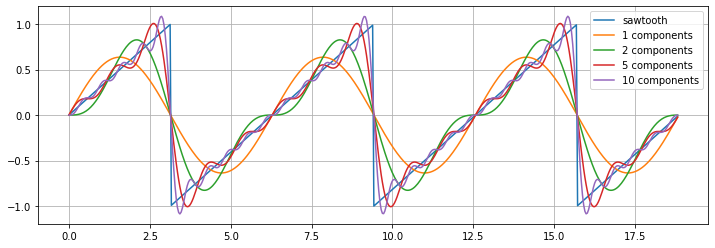

# Preface

This notebook introduces fundamental digital signal processing (DSP) concepts used in the 02471 Machine Learning for Signal Processing course at DTU. It is targeted to students who are not familiar with signal processing and need a ressource to catch up. Note that this is however by no means a substitute for the course preriquisites; signal processing is **difficult** and this notebook is far from being exhaustive. Students are invited to check other well established ressources when in doubt, or come forward with questions.

The following assumes you are familiar with real analysis mathematics.

# Introduction

In signal processing, a signal usually refers to a time varying function or variable. Signals can be discrete (number of letters) or continuous (pressure, voltage) by nature. In the real world, signals are usually captured by sensors (e.g. a microphone captures pressure variations and converts them to an electrical signal).

A digital signal is a discrete representation of a signal. If the signal is continous by nature, the digital signal has been derived by sampling and quantization. Digital Signal Processing (DSP) is the analysis and processing of digital signals.


Sampling and quantization is performed by a analog-to-digital converter (ADC). The digital signal can them be processed by DSP processors. Once the signal has been processed, it can be converted back to a continuous signal by a digital-to-analog converter (DAC), if it should be used in the real world. In the real world, ADCs and DACs are widely embedded in many user products.

E.g. the electrical signal produced by the microphone on a laptop is fed to a built-in ADC, and this signal can then be compressed by a DSP processor to be sent over the internet. Conversely, a DAC converts the digital sound signals to continuous electrical signals so that they can be reproduced by the laptop speakers.

A typical signal processing chain is depicted below.


# Sampling

In math terms, the sampling of a continuous signal can be described as follows. Let $x(t)$ a continuous signal,

$$
\begin{aligned}
x \colon \mathbb{R} &\longrightarrow \mathbb{R} \\
t &\longmapsto x(t).
\end{aligned}
$$

A digital representation of $x(t)$ noted $x[n]$ can be defined as follows,

$$ x[n] = x(nT_s) , \quad \forall n \in \mathbb{Z}, $$

where $T_s$ is the **sampling period**. The smaller $T_s$, the finer and more accurate the digital representation of the signal, but also the heavier the representation. The sampling operation is more commonly characterized by the sampling frequency (or sampling rate) $f_s$,

$$ f_s = \frac{1}{T_s}.$$

**Example**: common audio sampling frequencies are 8 kHZ (telecommunications), 44.1 kHz (music CDs) and 48 kHz (movie tracks).

**Note**: for  math purists, these notations can seem abusive. In signal processing, notations like $x(t)$ are widely used to refer to the continuous time varying signal or function, without introducing $t$. In other words, $x(t)$ does not refer to the value taken by $x$ at $t$, but refers to the function $x$. Similarly, $x[n]$ refers to the function defined on the discrete domain. The usage of brackets is widely used to distinguish discrete signals from analog signals.

**Note**: the signals above were introduced as taking values in $\mathbb{R}$ but they can also take values in $\mathbb{C}$.

The sampling of a continuous signal can be described in the continuous domain by using the product of the original signal with a special function. Consider the following function called **Dirac comb** with period $T_s$,

$$
\begin{aligned}
\text{III}_{T_s} \colon \mathbb{R} &\longrightarrow \mathbb{R} \\
t &\longmapsto \sum_{k=-\infty}^{+\infty}\delta(t-kT_s),
\end{aligned}
$$

where $\delta$ is the Dirac delta function. In other words, $\text{III}_{T_s}$ is the function that equals zero everywhere except on points evenly spaced by $T_s$.


Sampling $x(t)$ can be seen as multiplying $x(t)$ with $\text{III}_{T_s}$,

$$
\forall t \in \mathbb{R}, \quad (\text{III}_{T_s} x)(t) = \left\{
\begin{aligned}
&x(n{T_s}) &&\text{if }\exists n \in \mathbb{Z} \text{ such that } t=n{T_s},\\
&0 &&\text{else}.
\end{aligned}\right.
$$

This will show useful later on.

# Convolution

The convolution is a mathematical operation between two functions and outputs a new function. It is a fundamental tool in signal processing. The convolution operator is noted $*$ and it is well defined for integrable functions in $L^1(\mathbb{R})$,

$$
\begin{alignat}{3}
* \colon L^1(\mathbb{R}) &\times L^1(\mathbb{R}) &&\longrightarrow L^1(\mathbb{R}) \\
f&, g &&\longmapsto f * g
\end{alignat}
$$

It is defined as follows:

$$ \forall \tau \in \mathbb{R}, \quad (f * g)(\tau) = \int_{-\infty}^{+\infty}f(t)g(\tau-t)dt. $$

The convolution is commutative: $f * g = g * f$.

The **discrete convolution** is the adaptation to discrete signals and is defined as follows:

$$ \forall m \in \mathbb{Z}, \quad (f * g)[m] = \sum_{n=-\infty}^{+\infty}f[n]g[m-n]. $$

For discrete signals with finite lengths, signal values outside the definition range are assumed to be 0, and the sum becomes finite as most of the terms equal zero. E.g. if $x[n]$ with length $N_x$ is defined for $n \in \{0, 1, ..., N_x-1\}$, and $y[n]$ with length $N_y$ is defined for $n \in \{0, 1, ..., N_y-1\}$, then $(x * y)[m]$ as length $N_x+N_y-1$ and is defined for  $m \in \{0, 1, ..., N_x+N_y-1\}$

I am introducing this operation here as it is fundamental tool in DSP and it will be used later on.

The best way the understand this operation is to look at a visual representaion. The convolution can be summarized as an invertion of one of the signals, followed by a "delay-and-product-sum" operation; for each delay value $\tau$ or $m$, one signal is delayed with respect to the other before integrating the product of the signals. See the animation below. The convolution result $f*g$ in black is obtained by integrating the green area at each time step.


# Periodic signals

Let $x(t)$ a periodic signal. Therefore, there exists a period $T$ such that

$$ x(t+T) = x(t), \quad \forall t \in \mathbb{R}. $$

A periodic signal can also be characterised by its frequency $f$,

$$ f = \frac{1}{T}. $$

Example of a periodic signals:
* Sinusoids: $ x(t) = \sin(2 \pi f t), \forall t \in \mathbb{R} $
* Complex exponentials: $ x(t) = e^{i 2 \pi f t}, \forall t \in \mathbb{R} $
* Temperature across seasons (roughly, and disregarding rising trend due to global warming)

# Fourier series

Any continuous periodic signal can be written as a discrete sum of complex exponentials called Fourier series.

Let $x(t)$ be a periodic signal with period $T$. Therefore, there exists a sequence $c_n$ in $\mathbb{C}$ such that

$$ x(t) = \sum_{n=-\infty}^{+\infty} c_n e^{i 2 \pi \frac{n t}{T}}, \quad \forall t \in \mathbb{R}. $$

The $c_n$ are called the **Fourier coefficients**.

If $x(t)$ is real-valued, then for all $n \in \mathbb{Z}$, $c_n$ and $c_{-n}$ are complex conjugates and the sum can be rearanged as a sum of sines and cosines,

$$ x(t) = \sum_{n=0}^{+\infty} a_n \cos (i 2 \pi \frac{n t}{T}) + \sum_{n=0}^{+\infty} b_n \sin (i 2 \pi \frac{n t}{T}) , \quad \forall t \in \mathbb{R}. $$

This property is very powerful as it means that we can think of any periodic signal as a sum of well-known functions, the complex exponentials. Moreover, as you may know from your real analysis course, the complex exponentials form a **basis** of functions in the $L^2$ sense. This means that the $c_n$ can be derived by projecting $x(t)$ onto the individual basis functions,

$$ c_n = \frac{1}{T}\int_T x(t) e^{-i 2 \pi \frac{n t}{T}} dt, \quad \forall n \in \mathbb{Z}.$$

The Fourier series are a primary motivation of the **Fourier transform** (see later).

**Example**: Let $x(t)$ a sine function with frequency $f$,

$$ x(t) = \sin(2 \pi f t), \quad \forall t \in \mathbb{R}.$$

Euler's formula allows to rewrite $x(t)$ as

$$ x(t) = -\frac{i}{2}e^{i 2 \pi f t} + \frac{i}{2}e^{-i 2 \pi f t}, \quad \forall t \in \mathbb{R}.$$

Here the Fourier coefficients can be directly identified. We have
* $c_1 = -\frac{i}{2}$,
* $c_{-1} = \frac{i}{2}$,
* $c_n = 0$ if $n \notin \{-1, 1\}$.

**Example**: Let $x(t)$ a sawtooth wave with period $2 \pi$,

$$ x(t) = (\frac{t}{\pi} + 1) \text{ mod } 2 - 1, \quad \forall t \in \mathbb{R}.$$

It can be shown that $x(t)$ can be rewritten as

$$ x(t) = -\frac{2}{\pi}\sum_{n=1}^{+\infty}(-1)^k\sin\frac{kt}{k}.$$


```python
import matplotlib.pyplot as plt
import numpy as np

plt.rcParams['axes.grid'] = True

n = 500  # number of points
n_T = 3  # number of periods

t = np.arange(n)/n*n_T*2*np.pi
x = (t/np.pi + 1) % 2 - 1

fig, ax = plt.subplots(figsize=(12, 4))
ax.plot(t, x, label='sawtooth')

for n_components in [1, 2, 5, 10]:
    x = 0
    for k in range(1, n_components+1):
        x += (-1)**k*np.sin(k*t)/k
    x *= -2/np.pi
    ax.plot(t, x, label=f'{k} components')

ax.legend()
plt.show()  # you should see the more sines we add, the closer the total sum ressembles a sawtooth wave
```


    

    


# Fourier Transform

The Fourier transform is a mathematical transform that decomposes functions depending on time into functions depending on frequency. The term *Fourier transform* can refer to both the frequency domain representation of a signal and the mathematical operation itself.

The Fourier transform is first formally defined for continuous signals (not necesarilly periodic) and outputs a new continuous function depending on frequency. It is commonly noted $\mathcal{F}$ and is defined as

$$
\begin{aligned}
\mathcal{F} \colon L^1(\mathbb{R}) &\longrightarrow L^1(\mathbb{R}) \\
f &\longmapsto
\begin{aligned}[t]
    \mathcal{F}(x) \colon \mathbb{R} &\longrightarrow \mathbb{C} \\
    \omega &\longmapsto \int_{-\infty}^{+\infty}x(t)e^{-i\omega t}dt.
\end{aligned}
\end{aligned}
$$

In other words, given $x$ a continuous function depending on time,

$$ \mathcal{F}(x)(\omega) = \int_{-\infty}^{+\infty}f(t)e^{-i\omega t}dt, \quad \forall \omega \in \mathbb{R}. $$

This can be seen as the projection of $x$ onto the basis of complex exponentials.

A few notes/properties:
* The Fourier transform of $x$ is a function of $\omega$ which is a **frequency variable**
* The Fourier transform takes **complex** values
* The Fourier transform is **linear**: $\mathcal{F}(\alpha x + \beta y)=\alpha\mathcal{F}(x)+\beta\mathcal{F}(y)$
* It is common to note the Fourier transform of $x$ with an uppercase like this: $\mathcal{F}(x)=X$.
    * Sometimes even like this to empasize on the dependent variable, even though that's abusive for math purists: $\mathcal{F}[x(t)] = X(\omega)$
* The inverse Fourier transform of X is $$ \mathcal{F}^{-1}(X)(t) = \frac{1}{2\pi}\int_{-\infty}^{+\infty}X(\omega)e^{i\omega t}d\omega, \quad \forall t \in \mathbb{R}, $$ which is the same as the forward Fourier transform except there is a normalization factor and a plus sign in the exponential.

This was all in the continuous domain so far. Now, there is as rigorous formalism that I will skip that allows to adapt the continuous Fourier transform to digital signals while keeping *most* of its properties. I will not go into the intricacies about the validity of these properties for discrete signals, but the properties are overall maintained and the mechanism of the Fourier transform is the same in both domains: we decompose signals into frequencies.

Let $x[n]$ a discrete signal of length $N$. That is, we have a sequence of $N$ values $x[0], x[1], ..., x[N-1]$. The discrete Fourier transform (DFT) of $x[n]$ is defined as

$$ X[k] = \sum_{n=0}^{N-1}x[n]e^{-i 2 \pi \frac{kn}{N}}, \quad \forall k \in \{0, 1, ..., N-1\}.$$

Again, this resembles a projection on the basis of complex exponentials, except it was adapted for a discrete and finite-length signal by replace the integration sign with a discrete sum over the signal values.

The inverse DFT is

$$ x[n] = \frac{1}{N}\sum_{k=0}^{N-1}X[k]e^{i 2 \pi \frac{kn}{N}}, \quad \forall n \in \{0, 1, ..., N-1\}.$$

The discrete Fourier transform plays a huge role in DSP, and while the math theory behind can be difficult to fully grasp, it is absolutely essential to understand the gist of it: **it decomposes signals into frequencies**. The frequency components are best observed by plotting the (squared) modulus of the Fourier transform. The modulus or magnitude of the Fourier transform is often refered to as **spectrum**, and the analysis of signals using the Fourier transform as **spectral analysis**. The phase information is more difficult to interpret and can be disregarded for this course.

**Example**: the DFT is inplemented in `numpy` under `numpy.fft.fft`. FFT stands for Fast Fourier Transform and is an optimized algorithm to calculate the DFT. The terms FFT and DFT are often used interchangeably.

Let's create a simple signal consisting of a sum of 2 sinusoids with different frequencies. You will see how the DFT is able to resolve the 2 components.


```python
n = 512  # number of points
fs = 16e3  # sampling frequency

f1 = 2000  # frequency of the first component
f2 = 4000  # frequency of the second component

t = np.arange(n)/fs  # time axis
x = np.sin(2*np.pi*f1*t) + np.sin(2*np.pi*f2*t)  # time-domain signal
X = np.fft.fft(x)  # DFT
f = np.arange(n)/n*fs  # frequency axis; see details further below

fig, axes = plt.subplots(1, 2, figsize=(14, 4))
axes[0].plot(t, x)
axes[0].set_title('time domain')
axes[1].plot(f, np.abs(X))  # we plot the magnitude as X is complex
axes[1].set_title('frequency domain')

plt.show()  # you should see two clean spikes at locations corresponding to f1 and f2
#  you should also see two extra spikes at fs-f1 and fs-f2; see details further below
```


    

    


A few practical notes here already:
* The DFT output is **two-sided**. Half of it's values correspond to **negative** frequencies. This makes sense for complex-valued signals, but for real-valued signals, opposite frequencies are conjugates and the information is thus redundant. It is thus common to **crop half of the FFT output**. You can also check the documentation for `numpy.fft.rfft` for more details, which outputs a one-sided signal already.
* Building the frequency vector axis for the output can be confusing. However you should keep in mind this: **the resolution in the frequency domain is always $\frac{f_s}{N}$**, where $f_s$ is the sampling frequency and $N$ is the number of points.
    * This means that increasing $f_s$ gives a worse resolution in the frequency domain. **A finer resolution in the time domain means a coarser resolution in the frequency domain**. This is known as the **time-frequency duality**.
    * The frequency values corresponding to the raw FFT output are ordered as follows:
        * if N is even:
        $$ 0,\ \frac{f_s}{N},\ ...,\ \frac{N}{2}\frac{f_s}{N},\ (-\frac{N}{2}+1)\frac{f_s}{N},\ ...,\ -\frac{f_s}{N}$$
        * if N is odd:
        $$ 0,\ \frac{f_s}{N},\ ...,\ \frac{N-1}{2}\frac{f_s}{N},\ -\frac{N-1}{2}\frac{f_s}{N},\ ...,\ -\frac{f_s}{N}$$
      Yes, we first have the positive frequencies in increasing order up to $\frac{f_s}{2}$, and then the negative frequencies increasing from $-\frac{f_s}{2}$ to 0.

FAQ:
* *But you drew positive frequencies in the frequency-domain plot above up to $\frac{f_s}{2}$!*
    * Yes, this was just to show how the raw FFT output is ordered. If you don't want to crop half of the FFT nor use `numpy.fft.rfft` and want to plot the entire spectrum including negative frequencies, then you would replace the positve frequencies above $\frac{f_s}{2}$ with the negative frequencies listed above and eventually flip the two halves such that the values increase from -$\frac{f_s}{2}$ to $\frac{f_s}{2}$. You can also check `numpy.fft.fftshift`.
* *What about the frequencies above $\frac{f_s}{2}$ contained in the signal then?*
    * If the sampling frequency is $f_s$, then the maximum representable frequency in the digital signal is $\frac{f_s}{2}$. In other words, if a continuous signal is sampled at a sampling frequency $f_s$, then all the information at frequencies above $\frac{f_s}{2}$ is **lost**. This is the **Nyquist-Shannon sampling theoreom** and will be detailed further below. I didn't introduce the sampling theorem yet because I wanted to introduce the convolution and the FFT before to better illustrate it.
* *Considering if $N$ is even or odd is tedious... How can I easily and consistently build the frequency vector axis correctly?*
    * I do as follows:
        * I remember the resolution is always $\frac{f_s}{N}$ and build the entire frequency vector of length $N$ including the frequencies above $\frac{f_s}{2}$ (or negative frequencies): `f = np.arange(n)/n*fs`
        * I find the frequencies strictly above $\frac{f_s}{2}$: `mask = f > fs/2`
            * If I want a one-sided spectrum I discard them: `f = f[mask]`
            * If I want a two-sided spectrum I substract $f_s$ to them: `f[mask] -= fs`
      
      You can also use the `numpy.fft.fftfreq` and `np.fft.rfftfreq` functions.

# Convolution theorem

The convolution theorem states that convolution in the time-domain is the same as multiplication in the frequency domain. Conversely, multiplication in the time-domain is the same as convolution in the frequency domain.

In the continous domain, let $x(t)$ and $y(t)$ two signals in $L^1(\mathbb{R})$. With $\mathcal{F}$ the Fourier transform operator for continuous functions, and $*$ the continuous convolution operator, we have

$$ \mathcal{F}(x*y) = \mathcal{F}(x)\mathcal{F}(y), $$
$$ \mathcal{F}(xy) = \frac{1}{2\pi}\mathcal{F}(x)*\mathcal{F}(y). $$

This is quite powerful as it means we can decide to derive a convolution, which is usually an expensive operation, in the frequency domain instead. Indeed, an immediate consequence is

$$ x*y = \mathcal{F}^{-1}(\mathcal{F}(x)\mathcal{F}(y)). $$

This means we can perform a multiplication in the frequency domain and use back and forth Fourier transforms between the time and frequency domain to obtain the same result as a convolution in the time domain.

Now for discrete signals, let $x[n]$ and $y[n]$ two signals of length $N$. With $\mathcal{F}$ the DFT operator and $*$ the discrete convolution operator, we have

$$ \mathcal{F}(x*y) = \mathcal{F}(x)\mathcal{F}(y), $$
$$ \mathcal{F}(xy) = \frac{1}{N}\mathcal{F}(x)*\mathcal{F}(y). $$

Note that if $x[n]$ and $y[n]$ do not have same length, we can simply zero-pad the shorter signal until lenghts are the same, such that point-wise multiplication is possible.

In the snippet below I attempt to verify both properties.


```python
n = 128  # number of points

fig, axes = plt.subplots(2, 1, figsize=(12, 6))

# first property: F(x*y)=F(x)F(y)
x = np.random.randn(n)
y = np.random.randn(n)
z = np.convolve(x, y)

X = np.fft.fft(x, n=len(z))  # forcing the FFT output to be same length as z
Y = np.fft.fft(y, n=len(z))  # forcing the FFT output to be same length as z

Z1 = np.fft.fft(z)
Z2 = X*Y

axes[0].plot(abs(Z1), label=r'$\mathcal{F}(x*y)$')
axes[0].plot(abs(Z2), label=r'$\mathcal{F}(x)\mathcal{F}(y)$')
axes[0].legend(loc='upper right')

# second property: F(xy)=F(x)*F(y)
# this one is a bit more tricky as we need to flip the FFTs before convolving
# we also need to filter out all the extra frequencies resulting from the convolution in the frequency domain
x = np.sin(2*np.pi*np.arange(n)*0.3)  # using random noise here does not give perfect result
y = np.sin(2*np.pi*np.arange(n)*0.1)  # using random noise here does not give perfect result
z = x*y

X = np.fft.fft(x)
Y = np.fft.fft(y)
X = np.fft.fftshift(X)  # flip before convolving
Y = np.fft.fftshift(Y)  # flip before convolving

Z1 = np.fft.fft(z)
Z1 = np.fft.fftshift(Z1)
Z2 = np.convolve(X, Y)/n
Z2 = Z2[n//2:-n//2+1]  # discard extra frequencies created from the convolution

axes[1].plot(abs(Z1), label=r'$\mathcal{F}(xy)$')
axes[1].plot(abs(Z2), label=r'$\frac{1}{N}\mathcal{F}(x)*\mathcal{F}(y)$')
axes[1].legend(loc='upper right')

plt.show()  # you should observe the curves overlap in both plots
```


    

    

