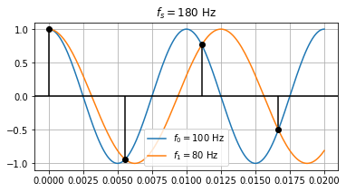

# Preface

This notebook introduces fundamental digital signal processing (DSP) concepts used in the 02471 Machine Learning for Signal Processing course at DTU. It is targeted to students who are not familiar with signal processing and need a resource to catch up. Note that this is however by no means a substitute for the course prerequisites; signal processing is **difficult** and this notebook is far from being exhaustive. Students are invited to check other well established resources when in doubt, or come forward with questions.

The following assumes you are familiar with real analysis mathematics.

# Introduction

In signal processing, a signal usually refers to a time varying function or variable. Signals can be discrete (number of letters) or continuous (pressure, voltage) by nature. In the real world, signals are usually captured by sensors (e.g. a microphone captures pressure variations and converts them to an electrical signal).

A digital signal is a discrete representation of a signal. If the signal is continuous by nature, the digital signal has been derived by sampling and quantization. Digital Signal Processing (DSP) is the analysis and processing of digital signals.


Sampling and quantization is performed by a analog-to-digital converter (ADC). The digital signal can them be processed by DSP processors. Once the signal has been processed, it can be converted back to a continuous signal by a digital-to-analog converter (DAC), if it should be used in the real world. In the real world, ADCs and DACs are widely embedded in many user products.

E.g. the electrical signal produced by the microphone on a laptop is fed to a built-in ADC, and this signal can then be compressed by a DSP processor to be sent over the Internet. Conversely, a DAC converts the digital sound signals to continuous electrical signals so that they can be reproduced by the laptop speakers.

A typical signal processing chain is depicted below.


# Sampling

In math terms, the sampling of a continuous signal can be described as follows. Let  a continuous signal,


A digital representation of  noted  can be defined as follows,


where  is the **sampling period**. The smaller , the finer and more accurate the digital representation of the signal, but also the heavier the representation. The sampling operation is more commonly characterized by the sampling frequency (or sampling rate) ,


**Example**: common audio sampling frequencies are 8 kHz (telecommunications), 44.1 kHz (music CDs) and 48 kHz (movie tracks).

**Note**: for math purists, these notations can seem abusive. In signal processing, notations like  are widely used to refer to a continuous signal or function, without introducing . In other words,  does not refer to the value taken by  at , but refers to the function . Similarly,  refers to the function defined on the discrete domain. The usage of brackets is widely used to distinguish discrete signals from analog signals.

**Note**: the signals above were introduced as taking values in  but they can also take values in .

The sampling of a continuous signal can be described in the continuous domain by using the product of the original signal with a special function. Consider the following function called **Dirac comb** with period ,


where  is the Dirac delta function. In other words,  is the function that equals zero everywhere except on points evenly spaced by .


Sampling  can be seen as multiplying  with ,


This will show useful later on.

# Convolution

The convolution is a mathematical operation between two functions and outputs a new function. It is a fundamental tool in signal processing. The convolution operator is noted  and it is well defined for integrable functions in ,


It is defined as follows:


The convolution is commutative: .

The **discrete convolution** is the adaptation to discrete signals and is defined as follows:


For discrete signals with finite lengths, signal values outside the definition range are assumed to be 0, and the sum becomes finite as most of the terms equal zero. E.g. if  with length  is defined for , and  with length  is defined for , then  as length  and is defined for  

I am introducing this operation here as it is fundamental tool in DSP and it will be used later on.

The best way the understand this operation is to look at a visual representation. The convolution can be summarized as an inversion of one of the signals, followed by a "delay-and-product-sum" operation; for each delay value  or , one signal is delayed with respect to the other before integrating the product of the signals. See the animation below. The convolution result  in black is obtained by integrating the green area at each time step.


# Periodic signals

Let  a periodic signal. Therefore, there exists a period  such that


A periodic signal can also be characterized by its frequency ,


Example of a periodic signals:
* Sinusoids: 
* Complex exponentials: 
* Temperature across seasons (roughly, and disregarding rising trend due to global warming)

# Fourier series

Any continuous periodic signal can be written as a discrete sum of complex exponentials called Fourier series.

Let  be a periodic signal with period . Therefore, there exists a sequence  in  such that


The  are called the **Fourier coefficients**.

If  is real-valued, then for all ,  and  are complex conjugates and the sum can be rearranged as a sum of sines and cosines,


This property is very powerful as it means that we can think of any periodic signal as a sum of well-known functions, the complex exponentials. Moreover, as you may know from your real analysis course, the complex exponentials form a **basis** of functions in the  sense. This means that the  can be derived by projecting  onto the individual basis functions,


The Fourier series are a primary motivation of the **Fourier transform** (see later).

**Example**: Let  a sine function with frequency ,


Euler's formula allows to rewrite  as


Here the Fourier coefficients can be directly identified. We have
* ,
* ,
*  if .

**Example**: Let  a sawtooth wave with period ,


It can be shown that  can be rewritten as


In the snippet below I verify this by adding a finite amount of these sines. We can see the more sines are added, the more the total sum resembles a sawtooth wave.


```python
import matplotlib.pyplot as plt
import numpy as np

plt.rcParams['axes.grid'] = True

n = 500  # number of points
n_T = 3  # number of periods

t = np.arange(n)/n*n_T*2*np.pi
x = (t/np.pi + 1) % 2 - 1

fig, ax = plt.subplots(figsize=(12, 4))
ax.plot(t, x, label='sawtooth')

for n_components in [1, 2, 5, 10]:
    x = 0
    for k in range(1, n_components+1):
        x += (-1)**k*np.sin(k*t)/k
    x *= -2/np.pi
    ax.plot(t, x, label=f'{k} components')

ax.legend()
plt.show()  # you should see the more sines we add, the closer the total sum resembles a sawtooth wave
```


    

    


# Fourier Transform

The Fourier transform is a mathematical operation that decomposes functions depending on time into functions depending on frequency. The term *Fourier transform* can refer to both the frequency domain representation of a signal and the mathematical operation itself.

The Fourier transform is first formally defined for continuous signals (not necessarily periodic) and outputs a new continuous function depending on frequency. It is commonly noted  and is defined as


In other words, given  a continuous function depending on time,


This can be seen as the projection of  onto the basis of complex exponentials.

A few notes/properties:
* The Fourier transform of  is a function of  which is a **frequency variable** in radian per second (rad/s). Sometimes, a frequency variable in Hertz and noted  is used instead. In which case,  and the integral is changed accordingly.
* The Fourier transform takes **complex** values
* The Fourier transform is **linear**: 
* It is common to note the Fourier transform of  with an uppercase like this: .
    * Sometimes it is noted like this to emphasize on the dependent variable, even though that's abusive for math purists: 
* The inverse Fourier transform of X is  which is the same as the forward Fourier transform except there is a normalization factor and a plus sign in the exponential.

This was all in the continuous domain so far. Now, there is as rigorous formalism that I will skip that allows to adapt the continuous Fourier transform to digital signals while keeping *most* of its properties. I will not go into the intricacies about the validity of these properties for discrete signals, but the properties are overall maintained and the mechanism of the Fourier transform is the same in both domains: we decompose signals into frequencies.

Let  a discrete signal of length . That is, we have a sequence of  values . The discrete Fourier transform (DFT) of  is defined as


Again, this resembles a projection on the basis of complex exponentials, except it was adapted for a discrete and finite-length signal by replace the integration sign with a discrete sum over the signal values.

The inverse DFT is


The discrete Fourier transform plays a huge role in DSP, and while the math theory behind can be difficult to fully grasp, it is absolutely essential to understand the gist of it: **it decomposes signals into frequencies**. The frequency components are best observed by plotting the (squared) modulus of the Fourier transform. The modulus or magnitude of the Fourier transform is often referred to as **spectrum**, and the analysis of signals using the Fourier transform as **spectral analysis**. The phase information is more difficult to interpret and can be disregarded for this course.

The DFT is implemented in `numpy` under `numpy.fft.fft`. FFT stands for Fast Fourier Transform and is an optimized algorithm to calculate the DFT. The terms FFT and DFT are often used interchangeably.

**Example**: Let's create a simple signal consisting of a sum of 2 sinusoids with different frequencies. You will see how the DFT is able to resolve the 2 components.


```python
n = 512  # number of points
fs = 16e3  # sampling frequency

f1 = 2000  # frequency of the first component
f2 = 4000  # frequency of the second component

t = np.arange(n)/fs  # time axis
x = np.sin(2*np.pi*f1*t) + np.sin(2*np.pi*f2*t)  # time-domain signal
X = np.fft.fft(x)  # DFT
f = np.arange(n)/n*fs  # frequency axis; see details further below

fig, axes = plt.subplots(1, 2, figsize=(14, 4))
axes[0].plot(t, x)
axes[0].set_title('time domain')
axes[1].plot(f, np.abs(X))  # we plot the magnitude as X is complex
axes[1].set_title('frequency domain')

plt.show()  # you should see two clean spikes at locations corresponding to f1 and f2
# you should also see two extra spikes at fs-f1 and fs-f2; see details further below
```


    

    


A few practical notes here already:
* The DFT output is **two-sided**. Half of it's values correspond to **negative** frequencies. This makes sense for complex-valued signals, but for real-valued signals, opposite frequencies are conjugates and the information is thus redundant. It is thus common to **crop half of the FFT output**. You can also check the documentation for `numpy.fft.rfft` for more details, which outputs a one-sided signal already.
* Building the frequency vector axis for the output can be confusing. However you should keep in mind this: **the resolution in the frequency domain is always **, where  is the sampling frequency and  is the number of points.
    * This means that increasing  gives a worse resolution in the frequency domain. **A finer resolution in the time domain means a coarser resolution in the frequency domain**. This is known as the **time-frequency duality**.
    * The frequency values corresponding to the raw FFT output are ordered as follows:
        * if N is even:
        
        * if N is odd:
        
      Yes, we first have the positive frequencies in increasing order up to , and then the negative frequencies increasing from  to 0. These frequency values are commonly called **frequency bins**, as if the energy was falling in *bins* centered at those frequencies. 

FAQ:
* *But you drew positive frequencies in the frequency-domain plot above up to !*
    * Yes, this was just to show how the raw FFT output is ordered, and I didn't rename half of the x-axis ticks to avoid too much confusion. If you don't want to crop half of the FFT nor use `numpy.fft.rfft` and want to plot the entire spectrum including negative frequencies, then you would replace the positive frequencies above  with the negative frequencies listed above and eventually flip the two halves such that the values increase from - to . You can also check `numpy.fft.fftshift`.
* *What about the frequencies above  contained in the signal then?*
    * If the sampling frequency is , then the maximum representable frequency in the digital signal is . In other words, if a continuous signal is sampled at a sampling frequency , then all the information at frequencies above  is **lost**. This is the **Nyquist-Shannon sampling theorem** and I will detail it further below. I didn't introduce the sampling theorem yet because I wanted to introduce the convolution and the FFT before to better explain it.
* *Considering if  is even or odd is tedious... How can I easily and consistently build the frequency vector axis correctly?*
    * I do as follows:
        * I remember the resolution is always  and build the entire frequency vector of length  including the frequencies above  (or negative frequencies): `f = np.arange(n)/n*fs`
        * I find the frequencies strictly above : `mask = f > fs/2`
            * If I want a one-sided spectrum I discard them: `f = f[mask]`
            * If I want a two-sided spectrum I subtract  to them: `f[mask] -= fs`
      
      This will consistently give a correct frequency axis regardless of  being even or odd. You can also use the `numpy.fft.fftfreq` or `np.fft.rfftfreq` functions.

# Convolution theorem

The convolution theorem states that convolution in the time-domain is the same as multiplication in the frequency domain. Conversely, multiplication in the time-domain is the same as convolution in the frequency domain.

In the continuous domain, let  and  two signals in . With  the Fourier transform operator for continuous functions, and  the continuous convolution operator, we have


This is quite powerful as it means we can decide to derive a convolution, which is usually an expensive operation, in the frequency domain instead. Indeed, an immediate consequence is


This means we can perform a multiplication in the frequency domain and use back and forth Fourier transforms between the time and frequency domain to obtain the same result as a convolution in the time domain.

Now for discrete signals, let  and  two signals of length . With  the DFT operator and  the discrete convolution operator, we have


Note that if  and  do not have same length, we can simply zero-pad the shorter signal until lengths are the same, such that point-wise multiplication is possible.

In the snippet below I attempt to verify both properties.


```python
n = 128  # number of points

fig, axes = plt.subplots(2, 1, figsize=(12, 6))

# first property: F(x*y)=F(x)F(y)
x = np.random.randn(n)
y = np.random.randn(n)
z = np.convolve(x, y)

X = np.fft.fft(x, n=len(z))  # forcing the FFT output to be same length as z
Y = np.fft.fft(y, n=len(z))  # forcing the FFT output to be same length as z

Z1 = np.fft.fft(z)
Z2 = X*Y

axes[0].plot(abs(Z1), label=r'')
axes[0].plot(abs(Z2), label=r'')
axes[0].legend(loc='upper right')

# second property: F(xy)=F(x)*F(y)
# this one is a bit trickier as we need to flip the FFTs before convolving
# we also need to filter out all the extra frequencies resulting from the convolution in the frequency domain
x = np.sin(2*np.pi*np.arange(n)*0.3)  # using random noise here does not give perfect result
y = np.sin(2*np.pi*np.arange(n)*0.1)  # using random noise here does not give perfect result
z = x*y

X = np.fft.fft(x)
Y = np.fft.fft(y)
X = np.fft.fftshift(X)  # flip before convolving
Y = np.fft.fftshift(Y)  # flip before convolving

Z1 = np.fft.fft(z)
Z1 = np.fft.fftshift(Z1)
Z2 = np.convolve(X, Y)/n
Z2 = Z2[n//2:-n//2+1]  # discard extra frequencies created from the convolution

axes[1].plot(abs(Z1), label=r'')
axes[1].plot(abs(Z2), label=r'')
axes[1].legend(loc='upper right')

plt.show()  # you should observe the curves overlap in both plots
```


    

    


# Nyquist-Shannon sampling theorem

Briefly put, when sampling at a frequency , the sampling theorem says that the highest representable frequency is . In other words, the sampling frequency should be at least twice as high as the highest frequency component of the sampled signal.

An simple example to illustrate this is the sampling of a sinusoid. Consider a sinusoid with frequency  sampled at a different frequencies .


```python
f0 = 100  # sinusoid frequency
T = 2e-2  # sinusoid duration in seconds

# first create a sinusoid with a fine time step; this will represent the continuous signal
fs_hi = 8e3  # high sampling frequency
t_cont = np.arange(0, T+1/fs_hi, 1/fs_hi)  # fine time vector with time step 1/fs
x_cont = np.sin(2*np.pi*f0*t_cont)  # this represents the continuous signal

fig, axes = plt.subplots(1, 3, figsize=(16, 3))

# now let's create a coarse digital signals for different low sampling frequencies
for ax, fs_lo in zip(axes, [1000, 500, 200]):
    ax.plot(t_cont, x_cont)
    t_coarse = np.arange(0, T+1/fs_lo, 1/fs_lo)
    x_coarse = np.sin(2*np.pi*f0*t_coarse)
    ax.stem(t_coarse, x_coarse, 'k', markerfmt='ko', basefmt=' ')
    ax.axhline(0, color='k')
    ax.set_title(f' Hz')

plt.show()
```


    

    


Can you see where the problem arises once we set  below ? It will not be possible to reconstruct the continuous signal anymore from the digital signal. To see why, imagine  and we have two sinusoids, one at  and .


```python
fig, ax = plt.subplots(figsize=(6, 3))

f0 = 100
f1 = 80

x_cont = np.cos(2*np.pi*f0*t_cont)
ax.plot(t_cont, x_cont, label=f' Hz')

x_cont = np.cos(2*np.pi*f1*t_cont)
ax.plot(t_cont, x_cont, label=f' Hz')

fs_lo = 180
t_coarse = np.arange(0, T, 1/fs_lo)
x_coarse = np.cos(2*np.pi*f0*t_coarse)
ax.stem(t_coarse, x_coarse, 'k', markerfmt='ko', basefmt=' ')
ax.axhline(0, color='k')

ax.set_title(f' Hz')
ax.legend()

plt.show()
```


    

    


As you can see, both signals produce the exact same samples! It's therefore impossible to know from the samples if the signal is a sinusoid at 40 Hz or a sinusoid at 100 Hz.

This can be explained in the general case of any signal using the convolution theorem and the Dirac comb function. Remember we saw above that sampling is the same as multiplying the signal with the Dirac comb,


where  is the sampling period. The convolution theorem gives us that the Fourier transform of a product is the convolution of the Fourier transforms in the frequency domain:


Now it can be shown that the Fourier transform of a Dirac comb is also a Dirac comb (you can try to prove it, it's a cool exercise) with period ,


Therefore, sampling in the time-domain is the same as convolving with a Dirac comb in the frequency domain. And convolving with a Dirac comb is the same as replicating the signal infinitely, with replicas evenly spaced by .

The image below describes this. In the image,  is an example spectrum of the original continuous signal , while  is the spectrum of the sampled signal . Since  is real-valued,  is symmetric around . You can see the spectrum is replicated infinitely along the frequency axis, with copies evenly spaced by . The highest frequency component of the original signal is .


We can see now that if we have \frac{\omega_s}{2}">, the replicas would **overlap**. The frequency components above  would mirror back and get confused with lower frequencies. This is called **aliasing**. The highest representable frequency, i.e.  in rad/s or  in Hz, is called the **Nyquist frequency**. The signal frequency content should be below the Nyquist frequency, otherwise we are undersampling the signal.


# Short-time Fourier transform

Imagine we wish to perform the spectral analysis of a short audio recording of 1 second. At 44.1 kHz, which is a common audio sampling rate, this audio recording would consist of 44100 samples. One way to proceed would be to do perform the 44100-point FFT of the entire signal in one go, and end with a 44100 frequency bins-long spectrum.

This is a bit silly, as on top of a 44100-point FFT being expensive (the FFT complexity is  at best and  at worst), we rarely need such a fine description of the signal spectrum in the frequency domain. And this is a 1 second-long signal only.

What is more common to do is to frame the signal in the time domain into adjacent windows and perform the FFT of each window. This is called a Short-time Fourier transform (STFT). This means we can have a representation of the signal that is both a function of time (frame number) and frequency!

The STFT is implemented in `scipy` under `scipy.signal.stft`. In the example below I generate a sinusoid with a frequency modulated by another sinusoid. The FFT of the entire signal shows high values across the entire range of swept frequencies, while the STFT allows to observe how the frequency changes over time.


```python
from scipy.signal import stft

fs = 4e3
f_mod = 1  # modulation frequency
f_delta = 200  # modulation depth
f0 = 800
T = 5
t = np.arange(0, T, 1/fs)
x = np.sin(2*np.pi*t*f0 + f_delta/f_mod*np.sin(2*np.pi*t*f_mod))

fig, axes = plt.subplots(3, 1, figsize=(12, 7))

axes[0].plot(t, x)
axes[0].set_title('Raw time-domain signal')
axes[0].set_xlabel('Time (s)')
axes[0].set_ylabel('Amplitude')

X = np.fft.rfft(x)
f = np.fft.rfftfreq(len(x), 1/fs)

axes[1].plot(f, abs(X))
axes[1].set_title('FFT')
axes[1].set_xlabel('Frequency (Hz)')
axes[1].set_ylabel('Magnitude')

f, t, S = stft(x, fs, nperseg=512)

axes[2].pcolormesh(t, f, abs(S), shading='gouraud')
axes[2].set_title('STFT')
axes[2].set_xlabel('Time (s)')
axes[2].set_ylabel('Frequency (Hz)')

fig.tight_layout()
plt.show()
```


    

    


FAQ
* *What if I still want to have representation of my signal that depends only on frequency? E.g. if I am interested in the average energy in each frequency bin?*
    * You can still use the STFT and average the energy across frames! This is the Long-Term Average Spectrum (LTAS) and is a cleaner way to visualize the signal energy in each frequency bin.


```python
from scipy.signal import stft

fig, axes = plt.subplots(2, 1, figsize=(12, 5))

X = np.fft.rfft(x)
f = np.fft.rfftfreq(len(x), 1/fs)

axes[0].plot(f, abs(X))
axes[0].set_title('FFT (ugly)')
axes[0].set_xlabel('Frequency (Hz)')
axes[0].set_ylabel('Magnitude')

f, t, S = stft(x, fs, nperseg=512)
LTAS = np.mean(abs(S), axis=1)

axes[1].plot(f, LTAS)
axes[1].set_title('LTAS (clean)')
axes[1].set_xlabel('Frequency (Hz)')
axes[1].set_ylabel('Magnitude')

fig.tight_layout()
plt.show()
```


    

    


* *But the magnitude (y-axis) does not match!*
    * There are different ways of normalizing the FFT and the STFT which are not always documented. Here the STFT implementation of `scipy` evidently applies a normalization whereas `np.fft.fft` does not. There is also windowing coming into play here which I didn't cover. Ultimately this does not matter so much as the most important is the location of the peaks and their relative difference.
* *How do I chose the length of the frame/window (`nperseg` option)?*
    * This is up to you. A shorter frame size will give you a better time resolution, but a worse frequency resolution. Conversely a longer frame gives a worse time resolution, but a better frequency resolution. However the FFT is the fastest for signal lengths equal to a power of 2. So common frame sizes for audio analysis are 256, 512, 1024, 2048  and 4096, depending on the sampling rate. For other applications with different sampling rates, frame sizes must be adapted consequently.

# Filters

A filter is a system that performs mathematical operations on a signal in the time domain and outputs a new signal in the time domain.

Filters can be analog for continuous signals (electronic circuits consisting of capacitors and coils in e.g. a guitar amps or speaker crossover filters), or digital for discrete signals (integrated circuits). In this course we will only cover digital filters.

In DSP, filters are linear time-invariant (LTI) systems. Consider two digital signals  and . A system  is an LTI system if it verifies the following properties:
* Linearity: 
* Time-invariance: 
    * For math purists, this is the correct notation: 
    * In other words, this means LTI systems do not change over time; if the input is delayed, the output is also delayed by the same amount.
